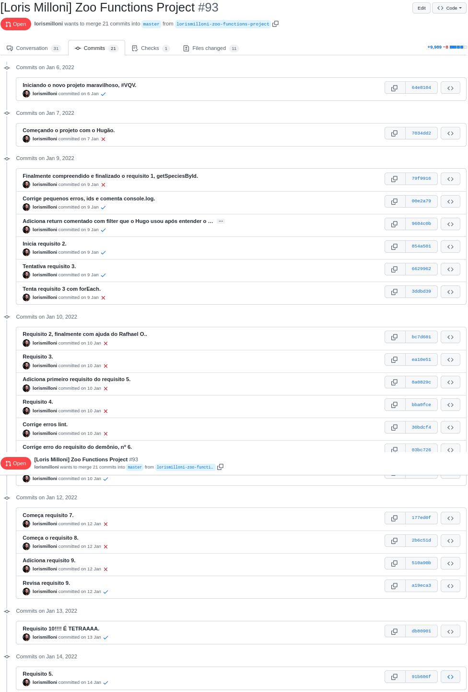

# study-project-zoo-functions
Made in **14/01/2021**.

## Here I was learning High Order Functions.
#### In this assignment I used HOFs to manipulate and create arrays, choose the right HOF for my purpose, use HOFs combined and read unit tests to create adequate functions.


#### Here is a code snippet:

 ```javascript
function funcionarios() {
  const infos = employees.map(({ id, firstName, lastName, responsibleFor }) => {
    const objFuncionario = {
      id,
      fullName: `${firstName} ${lastName}`,
    };
    objFuncionario.species = responsibleFor
      .map((idAnimal) => species
        .find((especie) => especie.id === idAnimal).name);
    objFuncionario.locations = responsibleFor
      .map((idAnimal) => species
        .find((especie) => especie.id === idAnimal).location);
    return objFuncionario;
  });
  return infos;
}
 ```

#### Trybe has a private repository with files that can't be shared. So here is my commit history print:


#### Here is the Trybe Evaluator

